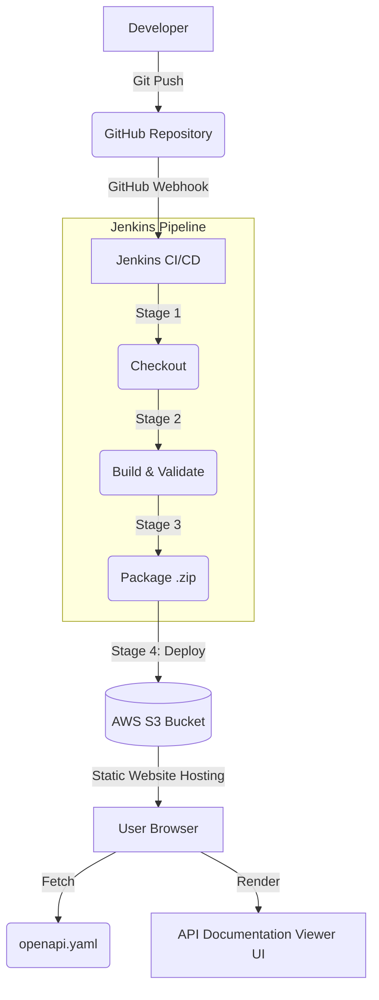

# API Documentation Viewer

API Documentation Viewer is a modern, responsive, and static web application for exploring, understanding, and testing OpenAPI documentation.

---

## 🎯 Project Overview

### Problem Statement
Traditional API documentation often lacks interactivity, modern design aesthetics, and simple deployment strategies. Developers need a lightweight, beautiful, and cloud-ready portal to understand and test API endpoints without relying on heavy backend frameworks.

### Objectives
1. Build a modern, static UI to read and display an `openapi.yaml` specification.
2. Ensure the UI is responsive, fast, and user-friendly, with dark/light mode support.
3. Establish a full DevOps CI/CD pipeline using GitHub and Jenkins.
4. Prepare the application for automated deployment to AWS S3 as a static website.

---

## ✨ Features

- **Dynamic OpenAPI Parsing**: Loads and parses `openapi.yaml` entirely in the browser using `js-yaml`. No backend server required!
- **Modern UI/UX**: Built with a custom "developer cloud" dark theme, utilizing glassmorphism, gradients, and clean typography.
- **Interactive "Try it out"**: Simulates API requests directly from the UI with mock JSON responses.
- **Global Search**: Instantly filter endpoints by path, method, or description.
- **Responsive Layout**: Adapts seamlessly to mobile, tablet, and desktop screens.
- **Copy Utilities**: Quick copy-to-clipboard functionality for URLs and code blocks, accompanied by toast notifications.
- **CI/CD Ready**: Includes a robust `Jenkinsfile` for automated testing, packaging, and AWS S3 deployment.

---

## 🛠️ Technology Stack

- **Frontend**: HTML5, Vanilla CSS3, Vanilla JavaScript (ES6)
- **Data Format**: OpenAPI 3.0 (YAML)
- **Libraries**: `js-yaml` (for YAML parsing), `Lucide` (for SVG icons)
- **DevOps**: Git, GitHub, Jenkins, AWS CLI, S3 (Infrastructure as a Service)

---

## 🏗️ Architecture



---

## 📂 Project Structure

```text
api-documentation-viewer/
├── index.html                 # Main HTML layout
├── openapi.yaml               # The OpenAPI 3.0 specification
├── css/
│   ├── style.css              # Main styles, theme variables, layout
│   └── responsive.css         # Mobile and tablet breakpoints
├── js/
│   ├── app.js                 # Core logic: YAML parsing and UI generation
│   ├── search.js              # Endpoint filtering logic
│   └── theme.js               # Dark/Light mode toggle and localStorage
├── tests/
│   └── validate-openapi.js    # Node.js script to validate OpenAPI structure
├── Jenkinsfile                # Jenkins CI/CD Pipeline definition
├── package.json               # NPM scripts and dependencies for testing
└── README.md                  # Project documentation
```

---

## 🔄 DevOps & CI/CD Pipeline

This project is configured for automated CI/CD using **Jenkins**. 

### GitHub Branching Strategy
- `main`: Production-ready code.
- `develop`: Integration branch for features.
- `feature/*`: Developer branches for new features or bug fixes.

### GitHub Webhook Integration
To automate the pipeline:
1. Go to your GitHub Repository Settings > Webhooks.
2. Add a webhook URL pointing to your Jenkins server: `http://<jenkins-url>/github-webhook/`.
3. Select "Just the push event".
4. When a developer pushes code, GitHub notifies Jenkins, which automatically triggers the `Jenkinsfile` pipeline.

### Jenkins Pipeline Stages
1. **Checkout**: Pulls the latest code from GitHub.
2. **Install Dependencies**: Runs `npm install` to get `js-yaml` for validation.
3. **Build**: Verifies the existence of critical structural files (`index.html`, `openapi.yaml`, `css`, `js`).
4. **Validate OpenAPI**: Runs `node tests/validate-openapi.js`. If the YAML is structurally invalid, the pipeline **FAILS** and halts.
5. **Test**: Placeholder for automated UI/Unit testing.
6. **Package**: Zips the static assets (`index.html`, `css`, `js`, `openapi.yaml`) into an artifact.
7. **Deploy to AWS S3**: Uses the `aws s3 sync` command to upload files to an S3 bucket configured for Static Website Hosting. 

### AWS S3 Deployment
The deployment stage requires AWS credentials.
**IMPORTANT SECURITY RULE:** Credentials are **never** hardcoded. They are injected securely using the Jenkins Credentials Plugin (`AWS_ACCESS_KEY_ID` and `AWS_SECRET_ACCESS_KEY`).

---

## 🚀 How to Run Locally

Because the application uses JavaScript `fetch()` to load the `openapi.yaml` file, opening `index.html` directly (via `file://` protocol) will result in a CORS error in modern browsers. 

You must run a local web server:

**Option 1: Using Node.js (Recommended)**
```bash
# Install dependencies (only required for tests/server)
npm install

# Start a local static server
npm run serve
# The app will run at http://localhost:3000
```

**Option 2: Using Python**
```bash
# Start a simple HTTP server in the project directory
python -m http.server 8000
# Visit http://localhost:8000 in your browser
```

**Option 3: Using VS Code**
- Install the **Live Server** extension.
- Right-click `index.html` and select **"Open with Live Server"**.

---

## 🎓 Cloud Computing Project Demonstration Checklist

During your project review, make sure to demonstrate the following:
1. **The UI**: Show the responsive design, dark/light mode toggle, and the search functionality.
2. **OpenAPI Parsing**: Explain how `app.js` reads `openapi.yaml` without needing a backend server, making it a true static application.
3. **The Jenkinsfile**: Walk through the stages (Checkout -> Test -> Deploy).
4. **Validation Test**: Show `tests/validate-openapi.js` and explain how it prevents a bad API spec from being deployed.
5. **AWS Deployment Strategy**: Explain the final Jenkins stage that uses `aws s3 sync` to deploy to a static bucket, and why credentials are securely managed in Jenkins rather than hardcoded in the script.
Webhook integration test completed.